# AI Lead Engineer — Master Guide: notesQa Architecture

> **Автор:** Principal AI Architect  
> **Для:** Lead AI Engineer — підготовка до захисту архітектурних рішень  
> **Проєкт:** notesQa — AI Knowledge Assistant (NestJS + LangGraph + OpenSearch)

---

## Зміст

1. [Архітектура NestJS та Інфраструктура](#блок-1-архітектура-nestjs-та-інфраструктура)
2. [The Chat Flow — Еволюція одного запиту](#блок-2-the-chat-flow)
3. [LangGraph Deep Dive — Agentic Workflow](#блок-3-langgraph-deep-dive)
4. [Трирівнева Пам'ять](#блок-4-трирівнева-память)
5. [Battle Scars — Критичні проблеми та їх вирішення](#блок-5-battle-scars)
6. [Тестування та Оцінка Недетермінованих AI-Систем](#блок-6-тестування-та-оцінка-недетермінованих-ai-систем)
7. [Production та AWS Migration Path](#блок-7-production-та-aws-migration-path)
8. [Technical Leadership Playbook](#блок-8-technical-leadership-playbook)

---

## Блок 1: Архітектура NestJS та Інфраструктура

### 1.1 LangChain/LangGraph у NestJS DI

Ключова проблема: LangChain — це функціональна бібліотека (factory functions, чисті функції), а NestJS — жорстка OOP/DI-система (моделі, провайдери, lifecycle hooks). Ми **не загортаємо** кожну LangChain-функцію в провайдер. Натомість:

**Патерн:** _Factory Provider + OnModuleInit lazy build_

```
CheckpointerModule (provides 'CHECKPOINTER' via factory)
       ↓ inject
AgentModule → AgentService.onModuleInit() → buildAgentGraph(llm, vectorStore, checkpointer)
```

- `CheckpointerModule` — async factory provider. Створює `RedisSaver.fromUrl(redisUrl)` при старті. Це **єдина** LangGraph-залежність, яка потребує DI, бо Redis URL приходить з `ConfigService`.
- `AgentService` — збирає граф у `onModuleInit()`. Всі LangChain об'єкти (LLM, tools, nodes) створюються як **звичайні функції** всередині `buildAgentGraph()`, а не як NestJS providers.
- `LlmModule` надає `LlmService` з методами `getModel()` / `getFastModel()` — tiered LLM (GPT-4o для генерації, GPT-4o-mini для класифікації).

**Чому не робимо кожну ноду провайдером?**  
Ноди — це pure functions без власного стану. DI додав би лише overhead та circular dependency ризики. Граф компілюється один раз і живе як immutable singleton в `AgentService`.

### 1.2 Модульна карта

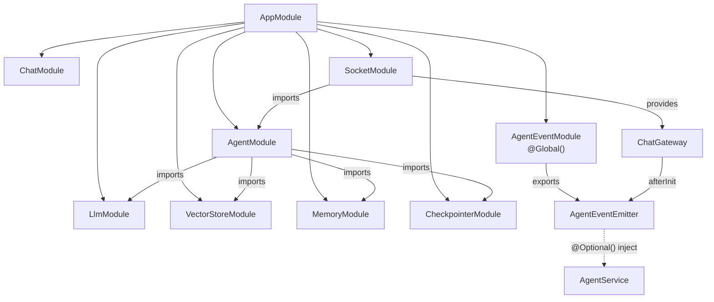

### 1.3 WebSockets vs REST Polling

| Критерій | REST Polling | WebSocket (socket.io) |
|---|---|---|
| **Latency** | 200-500ms * N polls | ~10ms per event (push) |
| **HITL UX** | Клієнт не знає коли interrupt наступить → poll кожну секунду? | `agent:interrupt` приходить **миттєво** коли граф зупиняється |
| **Streaming steps** | Неможливо без SSE | `agent:step` після кожної ноди графа |
| **Resource cost** | N * HTTP overhead per thread | 1 persistent connection per client |

**Висновок:** Для Human-in-the-Loop REST поллінг — це **архітектурний антипатерн**. Користувач чекає відповіді 5-15 секунд, і поллінг або витрачає ресурси (кожну секунду), або має великий lag (кожні 5 секунд). WebSocket дає instant push.

**Namespace та Rooms:**

```
Namespace: /chat
Room: threadId  ← кожен thread = окрема кімната
```

- При `chat:join` або `chat:message` клієнт додається до room `threadId`.
- `server.to(threadId).emit('agent:step', payload)` — події йдуть **тільки** цьому клієнту.

---

## Блок 2: The Chat Flow

### 2.1 Повний Lifecycle одного запиту (з HITL)

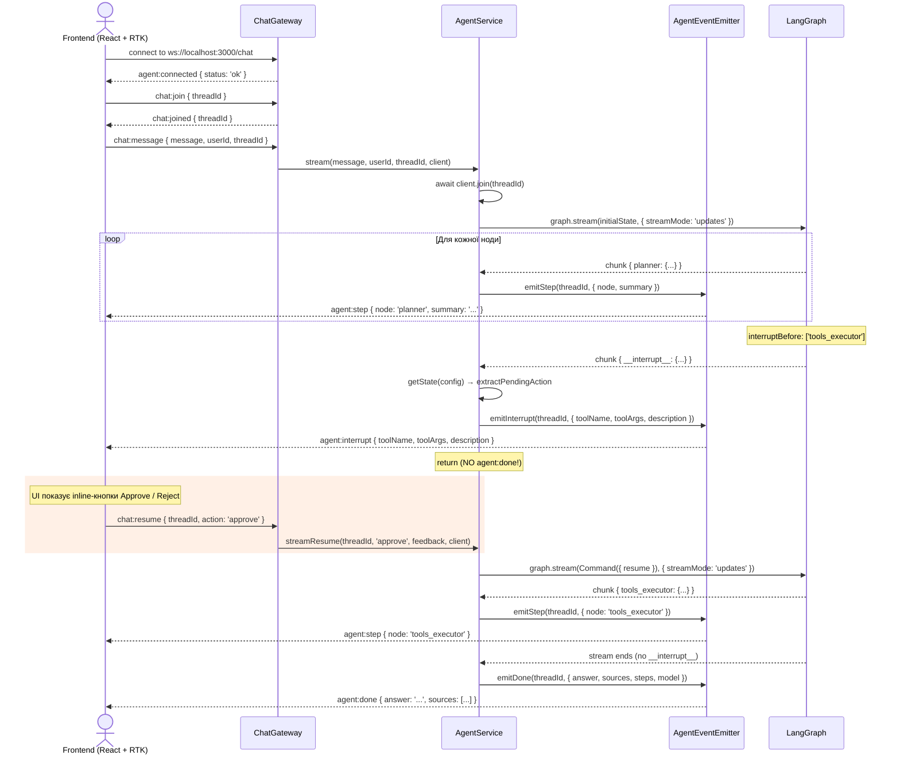

### 2.2 Архітектурний міст: AgentEventEmitter

```
AgentService ──(не залежить від)──✕── ChatGateway
      │                                     │
      └──→ AgentEventEmitter ←──────────────┘
              (Global singleton)
```

**Проблема:** `AgentService` не може залежити від `ChatGateway` (circular dependency). `ChatGateway` залежить від `AgentService` для виклику `stream()`. Якщо `AgentService` залежить від Gateway для `emit()` — цикл.

**Рішення:** `AgentEventEmitter` — **легковаговий брокер** (Mediator Pattern). `ChatGateway` реєструє socket.io `Server` у `afterInit()`. `AgentService` інжектує `AgentEventEmitter` через `@Optional()` і викликає `emitStep()`, `emitInterrupt()`, `emitDone()`. Ніхто не залежить один від одного напряму.

---

## Блок 3: LangGraph Deep Dive — Agentic Workflow

> _Цей розділ побудований як лекція: спочатку теорія, потім наш код як ілюстрація.  
> Мета — щоб після прочитання ти міг пояснити будь-яке рішення «від першопринципів»._

---

### 3.1 Теорія AI-агентів: Chain → ReAct → State Machine

Перш ніж розбирати код, важливо зрозуміти **три покоління** побудови AI-систем і **чому** ми опинились на графах.

#### Покоління 1: Chain (Ланцюжок)

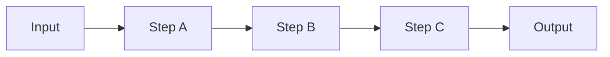

**Що це:** Лінійна послідовність кроків. LangChain `RunnableSequence` або LCEL pipe (`prompt | llm | parser`).

**Проблема:** Ланцюжок — це **конвеєр без розгалужень**. Ти не можеш сказати «якщо модель вирішила X — йди вузлом A, якщо Y — вузлом B». Немає циклів, немає retry, немає точки зупинки для людини. Для простих задач (summarize → translate → format) це працює. Для агента — ні.

**Аналогія з CS:** Ланцюжок — це **функціональна композиція** `f(g(h(x)))`. Детермінований pipeline.

#### Покоління 2: ReAct Agent (Reasoning + Acting)

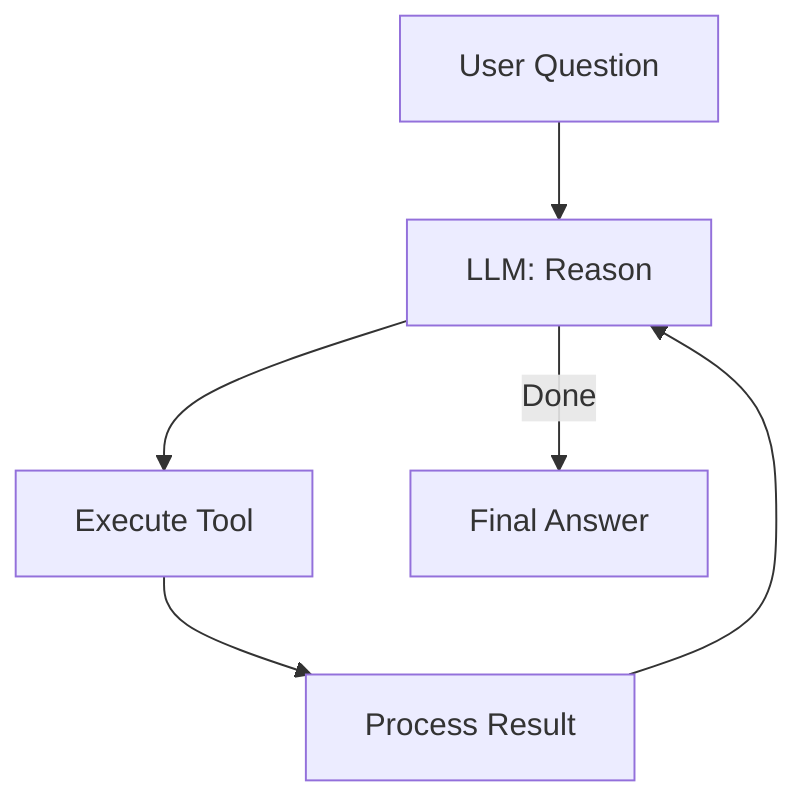

**Що це:** Цикл «Подумай → Дій → Спостерігай → Подумай знову». Патерн [ReAct (Yao et al., 2022)](https://arxiv.org/abs/2210.03629). У LangChain — це `createReactAgent()`.

**Як працює:** LLM сам вирішує **на кожному кроці**, чи потрібен ще один tool call. Модель генерує «thought», потім tool call, отримує результат, і знову думає. Цикл повторюється поки модель не вирішить, що має достатньо інформації.

**Проблеми для production:**
1. **Непередбачуваність:** LLM контролює _весь_ потік виконання. Ти не можеш гарантувати, що агент пройде через конкретні етапи (наприклад, завжди перевірить релевантність документів).
2. **Немає структурованого стану:** ReAct працює через `messages[]` — плоский масив повідомлень. Складно зберігати метадані (sources, steps, plan) структуровано.
3. **Важко дебажити:** Коли модель «загубилась» у 15-кроковому циклі, розібратись що пішло не так — дуже складно.
4. **Немає HITL:** Немає вбудованого механізму «зупинись і запитай людину».

**Аналогія з CS:** ReAct — це **while-loop** з LLM як умовою виходу. Потужно, але непередбачувано.

#### Покоління 3: State Machine на графах (LangGraph)

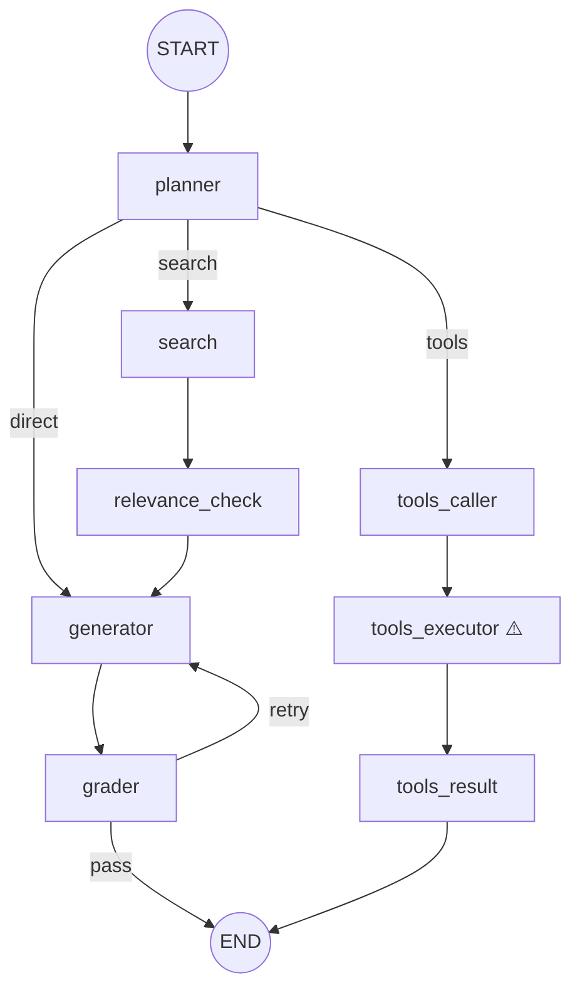

**Що це:** Directed graph, де **ти** визначаєш топологію (вузли та ребра), а LLM приймає рішення лише у **точках маршрутизації** (conditional edges). Всі інші переходи — детерміновані.

**Чому це краще для складних систем:**

| Проблема | ReAct | StateGraph |
|----------|-------|------------|
| Контроль потоку | LLM вирішує ВСЕ | Ти визначаєш топологію, LLM — тільки routing |
| Стан | Плоский `messages[]` | Typed `AgentState` з reducers |
| Deterministism | Непередбачуваний | Передбачуваний (фіксовані ребра) |
| HITL | Немає | `interruptBefore` / `interruptAfter` — native |
| Persistence | Немає | Checkpointer → crash recovery, resume |
| Debuggability | «Що робить модель на кроці 12?» | «Ми у ноді `grader`, retryCount=1» |
| Self-correction | Через промпт (ненадійно) | Через граф (grader → generator loop з лічильником) |

**Аналогія з CS:** StateGraph — це **Finite State Machine (FSM)** (або Directed Cyclic Graph, DCG), де стани — це ноди, а переходи — ребра. На відміну від класичного FSM, стан не атомарний (`idle`/`running`), а **структурований об'єкт** (наш `AgentState`).

> **Правило для інтерв'ю:**  
> _«Ми обрали граф а не ReAct, бо нам потрібна **гарантована топологія** (search завжди перевіряється на релевантність), **HITL** (людина підтверджує tool execution), і **typed state** замість плоского messages[]. ReAct дає свободу LLM, але в production ми хочемо свободу тільки у точках маршрутизації, а не у всьому потоці.»_

---

### 3.2 Анатомія LangGraph: Nodes, Edges, State

#### 3.2.1 Nodes (Вузли) — Pure Functions над State

**Теорія:**

З точки зору Computer Science, нода LangGraph — це **чиста функція** (або обгортка над LLM-викликом) з сигнатурою:

```
f: State → Partial<State>
```

Нода **приймає** поточний стан графа і **повертає** часткове оновлення. Вона не мутує стан напряму — LangGraph-рантайм застосовує оновлення через **reducers**.

**Ідемпотентність — чому це критично:**

> Нода повинна бути ідемпотентною: повторний виклик з тим самим State має дати той самий Partial&lt;State&gt;.

Чому? Бо LangGraph з checkpointer може **replay** ноду після crash recovery або при debug. Якщо нода має side-effects (наприклад, записує в БД без перевірки «чи вже записано?»), replay створить дублікати.

**Наш код як ілюстрація:**

```typescript
// nodes/planner.node.ts — чиста функція
export function createPlannerNode(llm: ChatOpenAI) {
  return async (state: AgentStateType) => {
    //              ↑ приймає State
    const response = await llm.invoke(messages);
    const plan = parsePlan(response.content);
    
    return {
      plan,                                        // Partial<State>
      steps: [`PLAN: decided "${plan}"`],           // append через reducer
    };
    //  ↑ повертає Partial<State>
  };
}
```

Зверни увагу: `createPlannerNode` — це **factory function** (Higher-Order Function, HOF). Вона отримує залежності (`llm`) через closure, а не через DI. Це дозволяє тримати ноди як чисті функції без NestJS overhead.

**Порівняння нод у нашому графі:**

| Нода | Тип | Input → Output | LLM? |
|------|-----|----------------|------|
| `planner` | Classification | `question → plan` | ✅ fast |
| `search` | Retrieval | `question → documents` | ❌ |
| `relevance_check` | Filter | `documents → documents (filtered)` | ❌ |
| `generator` | Generation | `question + documents + memory → answer` | ✅ primary |
| `grader` | Evaluation | `answer + documents → gradingFeedback` | ✅ fast |
| `tools_caller` | Tool Selection | `question → messages (with tool_calls)` | ✅ primary |
| `tools_executor` | Execution | `messages → messages (with ToolMessage)` | ❌ (prebuilt) |
| `tools_result` | Formatting | `messages → answer` | ✅ fast |

#### 3.2.2 State — Typed, Serializable, with Reducers

**Теорія:**

State у LangGraph — це не просто «змінна». Це **формальна специфікація** набору даних, які протікають через граф. Кожне поле стану має:
1. **Тип** (TypeScript generic)
2. **Reducer** — функція, яка визначає, як часткове оновлення від ноди застосовується до поточного стану
3. **Default** — початкове значення

**Чому reducers, а не просто перезапис?**

Розглянемо поле `steps`:
```typescript
steps: Annotation<string[]>({
  reducer: (current, update) => [...current, ...update],
  default: () => [],
})
```

Кожна нода повертає `{ steps: ['PLAN: decided "search"'] }`. Без reducer кожне оновлення **перезаписувало б** попереднє. З append-reducer — кроки **накопичуються**: `['PLAN: ...', 'SEARCH: ...', 'GENERATOR: ...']`.

Це та сама ідея, що Redux reducers у React — якщо ти знайомий з RTK, то `(state, action) => newState` — це аналогічний патерн.

**Повна таблиця reducer-стратегій нашого стану:**

| Поле | Reducer | Стратегія | Навіщо |
|------|---------|-----------|--------|
| `question` | _(default: replace)_ | Overwrite | Питання не змінюється |
| `plan` | _(default: replace)_ | Overwrite | Тільки planner пише |
| `documents` | _(default: replace)_ | Overwrite | Тільки search пише |
| `answer` | _(default: replace)_ | Overwrite | Тільки generator пише |
| `sources` | `(_, update) => update` | Replace | Останній результат |
| `steps` | `(cur, upd) => [...cur, ...upd]` | **Append** | Лог всіх нод |
| `messages` | `messagesStateReducer` | **LangGraph built-in** | Deduplication, tool_call matching |
| `memoryContext` | `(_, update) => update` | Replace | Задається один раз |
| `retryCount` | `(cur, upd) => cur + upd` | **Accumulate** | Лічильник retry |
| `gradingFeedback` | _(default: replace)_ | Overwrite | Останній фідбек |

**Серіалізація:**

Стан **має бути** JSON-серіалізованим, бо `RedisSaver` зберігає його через `JSON.SET`. Саме тому `Document[]` та `BaseMessage[]` — це класи LangChain з вбудованою серіалізацією (`toJSON()` / `fromJSON()`).

> **Правило:** Ніколи не клади у State об'єкти, які не серіалізуються (Streams, Sockets, Promises, class instances без `toJSON`). Це зламає checkpointer.

#### 3.2.3 Edges (Ребра) — Data Flow

**Теорія:**

У теорії графів, ребро (edge) — це спрямований зв'язок між двома вузлами. У LangGraph є два типи ребер:

**1. Static Edge (Безумовне ребро):**

```typescript
.addEdge('search', 'relevance_check')
```

Після `search` **завжди** йде `relevance_check`. Без умов, без LLM, без розгалужень. Це як `goto` у терміні control flow — детермінований перехід.

**2. Conditional Edge (Умовне ребро):**

```typescript
.addConditionalEdges('planner', routeAfterPlan, {
  search: 'search',
  generator: 'generator',
  tools_caller: 'tools_caller',
})
```

Тут `routeAfterPlan` — це **router function**. Вона приймає State і повертає ключ, який маппиться на цільову ноду. Саме тут LLM (непрямо) впливає на потік — planner-нода записує `plan` у State, а router читає його.

**Data Flow:** Дані протікають через граф **не по ребрах** (як у pipe), а **через State**. Ребро — це лише «хто після кого виконується». Дані передаються через зміну State. Це як **шина даних (data bus)** замість point-to-point.

**Наша топологія ребер:**

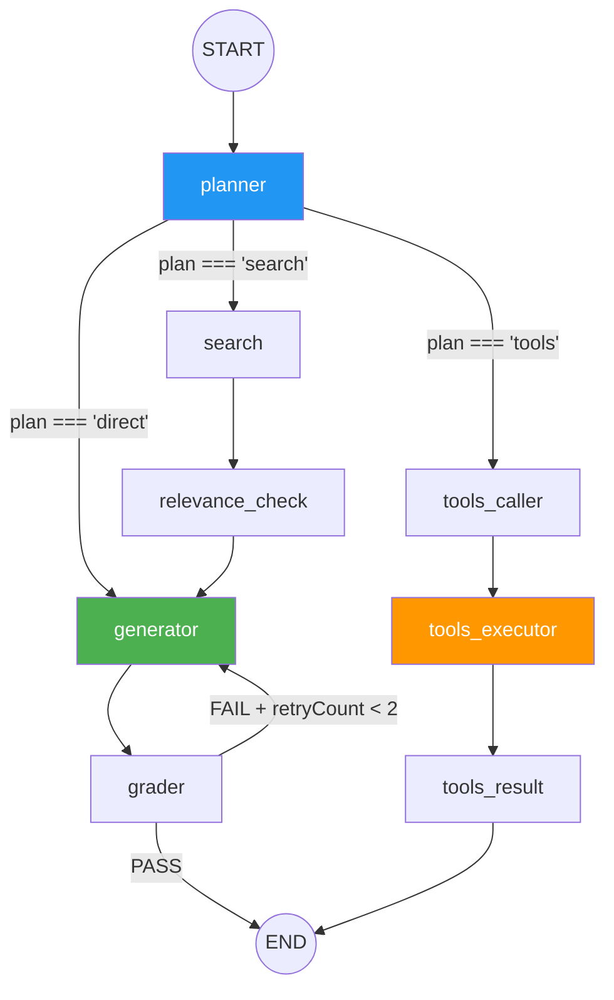

| Ребро | Тип | Логіка |
|-------|-----|--------|
| `START → planner` | Static | Точка входу |
| `planner → {search, generator, tools_caller}` | **Conditional** | `routeAfterPlan(state)` |
| `search → relevance_check` | Static | RAG pipeline |
| `relevance_check → generator` | Static | RAG pipeline |
| `generator → grader` | Static | Self-correction |
| `grader → {END, generator}` | **Conditional** | `routeAfterGrading(state)` |
| `tools_caller → tools_executor` | Static | Tools pipeline |
| `tools_executor → tools_result` | Static | Tools pipeline |
| `tools_result → END` | Static | Завершення |

#### 3.2.4 Conditional Edges — LLM-driven Routing

**Теорія маршрутизації:**

Conditional Edge — це точка, де рішення приймає **функція** (не LLM напряму). Але ця функція зазвичай читає поле State, яке було **заповнене LLM на попередній ноді**. Тобто маршрутизація — двокрокова:

```
1. LLM-нода → записує рішення у State  (planner → state.plan = 'search')
2. Router-функція → читає State і повертає ключ  (routeAfterPlan → 'search')
```

**Чому не дати LLM маршрутизувати напряму?**

Бо LLM може **галюцинувати** (див. розділ 3.4). Router-функція — це **валідаційний шар** між LLM-рішенням і control flow графа.

**Наш код:**

```typescript
// router/agent.router.ts
export function routeAfterPlan(
  state: AgentStateType,
): 'search' | 'generator' | 'tools_caller' {
  if (state.plan === 'search') return 'search';
  if (state.plan === 'tools') return 'tools_caller';
  return 'generator';  // ← FALLBACK: будь-що інше → generator
}
```

Зверни увагу на `return 'generator'` — це **default fallback**. Навіть якщо LLM поверне `'potato'` замість валідного плану, граф не зламається — він піде на `generator` (direct mode).

---

### 3.3 Три шляхи виконання графа (детально)

#### RAG Path: Retrieve → Check → Generate → Grade

```
planner("search") → search → relevance_check → generator → grader → END
```

1. **planner** — fast LLM класифікує запит як `'search'`
2. **search** — `VectorStoreService.search()` шукає документи в OpenSearch
3. **relevance_check** — фільтрує нерелевантні документи (cosine similarity threshold)
4. **generator** — primary LLM генерує відповідь з контексту документів + пам'яті
5. **grader** — fast LLM оцінює faithfulness + relevance → PASS/FAIL
6. При FAIL → generator (retry з `gradingFeedback`), max 2 retry

#### Direct Path: планувальник вирішив відповісти без пошуку

```
planner("direct") → generator → grader → END
```

Для привітань, загальних питань, follow-up'ів. Generator працює без документів, тільки з пам'яттю.

#### Tools Path: виклик інструменту з HITL

```
planner("tools") → tools_caller → [INTERRUPT] → tools_executor → tools_result → END
```

1. **tools_caller** — primary LLM з `bindTools([summarize, compare, list])` генерує `tool_call`
2. **INTERRUPT** — `interruptBefore: ['tools_executor']` зупиняє граф, чекає на approve/reject
3. **tools_executor** — prebuilt `ToolNode` виконує tool і повертає `ToolMessage`
4. **tools_result** — fast LLM форматує результат інструменту в user-friendly відповідь

### 3.4 Edge Cases та Надійність (Resilience)

#### 3.4.1 Захист від нескінченних циклів (Infinite Loop Protection)

**Проблема:** У нашому графі є цикл: `generator → grader → generator`. Якщо grader завжди повертає FAIL, граф зациклиться нескінченно.

**Рішення 1 — State Counter (`retryCount`):**

Це наш основний захист. Лічильник у стані, який акумулюється через reducer:

```typescript
// agent.state.ts
retryCount: Annotation<number>({
  reducer: (current, update) => current + update,  // 0 + 1 + 1 = 2
  default: () => 0,
})

// router/grader.router.ts
export function routeAfterGrading(state: AgentStateType): 'pass' | 'retry' {
  const MAX_RETRIES = 2;
  if (state.retryCount >= MAX_RETRIES) {
    return 'pass';  // Виходимо навіть якщо грейдер незадоволений
  }
  if (state.gradingFeedback?.trim().length > 0) {
    return 'retry';
  }
  return 'pass';
}
```

**Принцип:** Generator при кожному виклику повертає `{ retryCount: 1 }`. Reducer акумулює: `0 → 1 → 2`. Коли `retryCount >= MAX_RETRIES`, router примусово повертає `'pass'`, і граф виходить до END.

**Рішення 2 — `recursion_limit` (LangGraph built-in):**

LangGraph має глобальний safety net:

```typescript
const result = await graph.invoke(state, {
  ...config,
  recursionLimit: 25,  // Maximum number of node visits
});
```

Якщо граф пройде більше 25 нод за один invoke — LangGraph кине `GraphRecursionError`. Це **аварійне гальмо**, а не основний механізм контролю. Наш `retryCount` — це **graceful** вихід з циклу (повертаємо найкращу доступну відповідь), а `recursionLimit` — це **hard crash** (вилітаємо з помилкою).

> **Правило для проєктування:**  
> Кожен цикл у графі повинен мати **власний лічильник у State**. `recursion_limit` — лише safety net на рівні всього графа.

#### 3.4.2 Router Hallucination — Fallback та Default Transitions

**Проблема:** LLM-маршрутизатор може повернути неочікувану відповідь. Наприклад, planner повинен повернути `'search'`, `'direct'`, або `'tools'`, але LLM генерує `'I think we should search for documents'` або `'unknown'`.

**Як ми це вирішуємо (3 рівні захисту):**

**Рівень 1 — Prompt Engineering (Planner node):**
```typescript
// constants/prompts.ts
export const PLANNER_PROMPT = `...
Reply with ONLY one word:
- "search" — if the question asks about specific information
- "tools" — if the user wants to summarize/compare/list
- "direct" — if it's a greeting or general question
...`;
```
Промпт **жорстко** обмежує формат виходу до одного слова.

**Рівень 2 — Parser (Planner node):**
```typescript
// nodes/planner.node.ts
const planText = (response.content as string).trim().toLowerCase();

let plan: string;
if (planText.includes('tools')) {
  plan = 'tools';
} else if (planText.includes('search')) {
  plan = 'search';
} else {
  plan = 'direct';  // ← DEFAULT: все що незрозуміле = direct
}
```
Parser використовує `includes()` замість strict equality. Навіть якщо LLM поверне `'I recommend search'`, парсер витягне `'search'`.

**Рівень 3 — Router Fallback:**
```typescript
// router/agent.router.ts
export function routeAfterPlan(state): 'search' | 'generator' | 'tools_caller' {
  if (state.plan === 'search') return 'search';
  if (state.plan === 'tools') return 'tools_caller';
  return 'generator';  // ← DEFAULT FALLBACK
}
```
Навіть якщо парсер не справився і `state.plan = 'banana'`, router відправить граф на `generator` (безпечний direct mode).

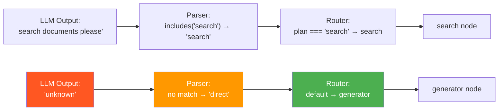

> **Патерн «Defense in Depth»:** Три шари захисту (prompt → parser → router fallback) гарантують, що граф **ніколи** не потрапить у неіснуючу ноду, навіть якщо LLM повністю галюцинує.

---

### 3.5 Tools та Function Calling

#### Теорія: як LLM «викликає» функції

LLM не виконує код. Замість цього використовується протокол **Function Calling** (OpenAI API):

1. Ми **описуємо** доступні інструменти через JSON Schema (назва, опис, параметри).
2. LLM **генерує** повідомлення типу `AIMessage` з полем `tool_calls`: `[{ name: 'summarize', args: { filename: 'doc1.pdf' } }]`.
3. Ми **виконуємо** функцію і повертаємо результат як `ToolMessage`.
4. LLM **бачить** ToolMessage і генерує фінальну відповідь.

У LangGraph це працює так:

```
tools_caller: llm.bindTools([summarize, compare, list])
             → AIMessage { content: '', tool_calls: [...] }
             → зберігається в state.messages

tools_executor: ToolNode reads tool_calls from messages
               → executes function
               → adds ToolMessage to state.messages

tools_result: reads ToolMessage from state.messages
             → formats into state.answer
```

**Наші інструменти:**

| Tool | Призначення | Args |
|------|-------------|------|
| `summarize` | Стисне документ | `{ filename }` |
| `compare` | Порівняє два документи | `{ file1, file2 }` |
| `list` | Покаже список файлів | `{}` |

#### Human-in-the-Loop для Tools

```typescript
// agent.graph.ts
return graph.compile({
  checkpointer,
  interruptBefore: ['tools_executor'],  // ← зупинка ПЕРЕД виконанням
});
```

`interruptBefore` — це декларативний спосіб сказати: «зупини граф перед цією нодою і чекай на людину». LangGraph:
1. Зберігає стан у checkpointer
2. Yield-ує `{ __interrupt__: [...] }` chunk у stream
3. Чекає на `Command({ resume })` для продовження

Це дозволяє людині **побачити** що саме агент хоче зробити (tool name + args) і **вирішити** — дозволити чи заборонити.

### 3.6 Tiered LLM Strategy

```
GPT-4o (primary):   generator, tools_caller (llm.bindTools)
GPT-4o-mini (fast): planner, grader, tools_result, relevance_check
```

**Rationale:** Класифікаційні ноди (planner, grader) не потребують reasoning-потужності GPT-4o. Використання mini-моделі зменшує **latency на 40-60%** та **вартість на 80%** для цих нод. Generator — єдина нода, де якість тексту критична.

**Наш код:**

```typescript
// agent.graph.ts
const classifierLlm = fastLlm ?? llm;  // fallback якщо fastLlm не задано

const graph = new StateGraph(AgentState)
  .addNode('planner', createPlannerNode(classifierLlm))   // fast
  .addNode('generator', createGeneratorNode(llm))          // primary
  .addNode('grader', createGraderNode(classifierLlm))      // fast
  .addNode('tools_caller', createToolsCallerNode(llmWithTools)) // primary (needs bindTools)
  .addNode('tools_result', createToolsResultNode(classifierLlm)) // fast
```

> **Правило для інтерв'ю:**  
> _«Ми розділяємо LLM на два tier'и: primary (GPT-4o) для генерації та tool calling, і fast (GPT-4o-mini) для класифікації. Це зменшує загальну latency на 40% і cost на 60%, бо більшість нод у графі — класифікатори, а не генератори.»_

---

## Блок 4: Трирівнева Пам'ять

### 4.1 Архітектура

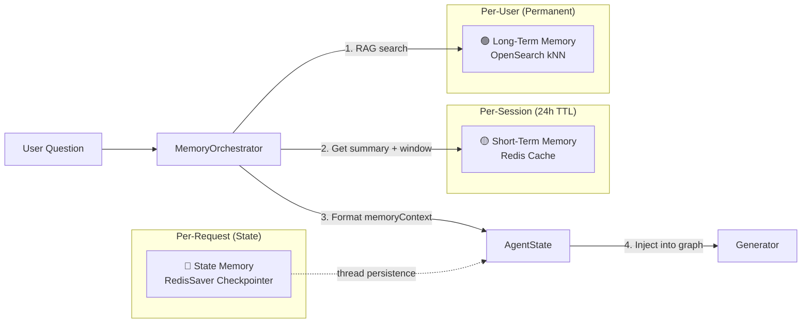

### 4.2 State Memory (Checkpointer) — `RedisSaver`

**Що зберігає:** Повний snapshot `AgentState` після кожної ноди графа.

**Для чого:**
- **Thread persistence:** `graph.invoke(state, { configurable: { thread_id } })` — один thread_id = одна розмова. При повторному виклику граф продовжує з останнього checkpointed стану.
- **HITL resume:** При `interruptBefore: ['tools_executor']` граф зупиняється, а стан зберігається. `Command({ resume })` відновлює виконання з того ж місця.
- **Crash recovery:** Якщо сервер впаде під час виконання графа, при перезапуску стан відновиться з Redis.

**Деталі:**
- Вимагає `redis/redis-stack` (не base Redis!) бо `RedisSaver` використовує `FT.CREATE` (RediSearch) та `JSON.SET` (RedisJSON).
- Registered via NestJS factory provider: `RedisSaver.fromUrl(redisUrl)`.

### 4.3 Short-Term Memory (STM) — Redis Cache

**Що зберігає:** Активне вікно повідомлень (sliding window) + стиснений summary попередніх повідомлень.

**Механізм:**
1. Кожне повідомлення додається у `stm:window:{userId}` (JSON array в Redis).
2. При перевищенні порогу токенів (має бути ≥ `maxWindowTokens * summarisationThreshold`):
   - Перша половина вікна відправляється на **summarisation** (через LLM).
   - Summary зберігається у `stm:summary:{userId}`.
   - У вікні залишається тільки друга половина.
3. При наступних запитах — summary + active window = повний контекст розмови.

**TTL:** 24 години. Після цього STM автоматично зникає.

### 4.4 Long-Term Memory (LTM) — OpenSearch kNN

**Що зберігає:** Всі повідомлення користувача та AI-відповіді як **векторні embeddings** в OpenSearch.

**Механізм:**
1. Кожен turn (`user`/`assistant`) проходить через `EmbeddedService.embedQuery(text)` — отримує vector [1536 dims].
2. Vector + metadata (userId, sessionId, role, timestamp) індексується в OpenSearch.
3. При новому запиті — **kNN semantic search** знаходить 5 найрелевантніших попередніх повідомлень.

**Fire-and-forget:** `persistTurn()` — async, але не await-ується в основному потоці. Затримка в LTM не блокує відповідь.

### 4.5 Як все збирається — `MemoryOrchestrator`

```typescript
// Виклик order:
1. ltm.search(userId, userMessage)       // RAG по минулих розмовах
2. stm.getSummary(userId)                 // Стиснутий контекст
3. stm.getActiveWindow(userId)            // Останні N повідомлень
4. stm.addMessage(userId, msg)            // Зберегти в STM
5. ltm.persistTurn(userId, ..., content)  // Fire-and-forget в LTM

// Результат → IFinalPromptContext:
{
  systemPrompt: MEMORY_SYSTEM_PROMPT,  // base system prompt
  longTermMemory: [...],                // семантично релевантні старі розмови
  summary: "...",                       // стиснутий контекст
  activeWindow: [...],                  // останні повідомлення
  currentUserMessage: "..."             // поточне питання
}
```

`buildMessagesFromMemory()` збирає це в фінальний масив `BaseMessage[]` для LLM:  
`[SystemMessage(system+LTM+summary+docs), ...history, HumanMessage(question)]`

---

## Блок 5: Battle Scars 🩹

Цей розділ описує критичні проблеми, які ми зустріли в production. Для кожної — **симптом**, **root cause**, **fix**, та **lesson learned**.

---

### 5.1 🔴 Redis Stack vs Base Redis

**Симптом:**
```
ReplyError: ERR unknown command 'FT.CREATE'
ReplyError: ERR unknown command 'JSON.SET'
```

Checkpointer падає при першому `graph.invoke()`.

**Root cause:**  
`@langchain/langgraph-checkpoint-redis` (RedisSaver) використовує **модулі Redis Stack**: RediSearch (`FT.CREATE` для повнотекстового індексу) та RedisJSON (`JSON.SET` для збереження стану як JSON). Стандартний образ `redis:latest` **не містить** цих модулів.

**Fix:**  
Замінили `redis:latest` на `redis/redis-stack:latest` у Docker Compose. Цей образ містить:
- RedisJSON — зберігання JSON-документів
- RediSearch — повнотекстовий та векторний пошук  
- RedisTimeSeries, RedisBloom — для майбутнього

**Lesson learned:**  
LangGraph Checkpointer для Redis — це **не** звичайний key-value storage. Він використовує advanced Redis modules для індексації та query. Завжди перевіряй вимоги persistence layer до Redis capabilities.

---

### 5.2 🔴 WS Room Isolation — «Клієнт підключається, але подій не отримує»

**Симптом:**  
Frontend підключається до `ws://localhost:3000/chat`, `connect` event спрацьовує, але `agent:step`, `agent:interrupt`, `agent:done` ніколи не приходять.

**Root causes (3 bugs, кожен незалежно вбивав комунікацію):**

**Bug A — `AgentEventEmitter` не глобальний:**
```
SocketModule→providers: [AgentEventEmitter]  ← свій екземпляр
AgentModule→providers: [AgentService]        ← @Optional() inject → null
```
NestJS DI scope: `AgentEventEmitter` зареєстрований тільки в `SocketModule`. `AgentService` живе в `AgentModule` і не бачить його. `@Optional()` повертає `null`. Всі `this.eventEmitter?.emitStep(...)` — **silent no-ops**.

→ **Fix:** Виділити `AgentEventModule` з `@Global()` → singleton доступний всюди.

**Bug B — `void client.join(threadId)` race condition:**
```typescript
void client.join(threadId);  // async, не чекаємо!
const streamIter = await this.graph.stream(...); // стартує миттєво
// Перші agent:step йдуть у room, але клієнт ще не приєднався
```
→ **Fix:** `await client.join(threadId)` перед `graph.stream()`.

**Bug C — GraphInterrupt не перехоплений:**
Очікували `GraphInterrupt` exception в `catch`. Але LangGraph JS в `streamMode: 'updates'` **yield-ує** `__interrupt__` як звичайний chunk (див. 5.3).

**Lesson learned:**  
WebSockets + DI = тонкий баланс. Один `@Optional()` inject, який повертає null, **мовчки** вбиває всю комунікацію. Завжди додавай діагностичний лог:
```typescript
this.logger.log(`EventEmitter available: ${!!this.eventEmitter}`);
```

---

### 5.3 🔴 Передчасний `agent:done` — «__interrupt__ як step»

**Симптом:**
```
[WS Rx] agent:step { node: '__interrupt__' }   ← ЩО?!
[WS Rx] agent:done { answer: '' }               ← UI скидає стан
```
Граф не зупиняється на HITL. UI ніколи не показує Approve/Reject.

**Root cause:**  
LangGraph JS (≥0.2) у режимі `streamMode: 'updates'` при `interruptBefore: ['tools_executor']` **не кидає `GraphInterrupt` exception**. Замість цього він yield-ує chunk з ключем `'__interrupt__'`. Наш цикл:
```typescript
for await (const chunk of streamIter) {
  const nodeName = Object.keys(chunk)[0];
  this.eventEmitter?.emitStep(threadId, { node: nodeName, ... });
  //                                     ↑ '__interrupt__' → agent:step!
}
// Цикл завершується нормально → emitDone() → agent:done { answer: '' }
```

**Fix:**
```typescript
for await (const chunk of streamIter) {
  const nodeName = Object.keys(chunk)[0];

  if (nodeName === '__interrupt__') {
    interrupted = true;
    const snapshot = await this.graph.getState(config);
    const pendingAction = this.extractPendingAction(snapshot);
    this.eventEmitter?.emitInterrupt(threadId, { threadId, ...pendingAction });
    break;  // ← не emitDone!
  }

  // ...emit step...
}

if (interrupted) return;  // ← блокуємо agent:done
this.eventEmitter?.emitDone(...);
```

**Lesson learned:**  
LangGraph поводиться **по-різному** залежно від `streamMode`:
- `streamMode: 'values'` / `invoke()` → кидає `GraphInterrupt` exception
- `streamMode: 'updates'` → yield-ує `{ __interrupt__: [...] }` chunk

Завжди тестуй exact chunk format. **Ніколи** не assume що всі chunks — це ноди графа.

---

### 5.4 🟡 Crash на `undefined` — LTM persist під час Tool Calls

**Симптом:**
```
TypeError: Cannot read properties of undefined (reading 'replace')
```
Crash у `LongTermMemoryService.persistTurnWithRetry` на 3-й спробі.

**Root cause:**  
Ланцюжок: `AgentService.stream()` завершується (interrupt або done) → `memory.recordAssistantResponse(userId, lastState.answer, threadId)`. При interrupt графа `lastState.answer` = `undefined` (generator ще не виконався). `undefined` передається як `content` → `embed(content)` → `embedQuery(content)` → внутрішній `.replace()` на `undefined` → crash.

**Fix (два рівні захисту):**

1. **Caller (MemoryOrchestrator):** `recordAssistantResponse` тепер приймає `string | undefined | null`. Якщо порожній — замінює на `'[Tool Execution]'`.
2. **Provider (LongTermMemoryService):** `persistTurn()` перевіряє `!content?.trim()` → skip з debug-логом. `indexTurn()` має аналогічний guard.

**Lesson learned:**  
AI-повідомлення — це не завжди текст. Tool calls = content може бути `null`, `undefined`, або `''`. Кожен сервіс, який обробляє AI output, **повинен** мати guard на порожній content.

---

### 5.5 🟡 Language Drift — «Відповідь французькою»

**Симптом:**  
Користувач питає українською → агент шукає документи → фінальна відповідь генерується **французькою**, **англійською** або іншою мовою.

**Root cause:**  
Промпти мали слабку інструкцію `"Answer in the same language as the question"`. Це працює у 90% випадків, але ламається коли:
- Документи написані іншою мовою → LLM «дрейфує» до мови контексту
- Tool results повертають англійський текст → LLM продовжує англійською
- `MEMORY_SYSTEM_PROMPT` взагалі **не мав** language інструкції

**Fix:**  
Створили **єдине джерело правди** — константу `LANGUAGE_RULE`:
```
⚠️ CRITICAL LANGUAGE INSTRUCTION (highest priority, overrides everything else):
Detect the language of the user's message and respond EXCLUSIVELY in that SAME language.
- NEVER switch languages, regardless of source documents or conversation history.
- This rule has ABSOLUTE priority over any other instruction.
```
Вставлено в **всі 6 промптів**: `PLANNER_PROMPT`, `RAG_PROMPT`, `DIRECT_PROMPT`, `TOOLS_CALLER_PROMPT`, `TOOLS_RESULT_PROMPT`, `MEMORY_SYSTEM_PROMPT`.

**Lesson learned:**  
LLMs визначають мову відповіді з **контексту вікна**, а не тільки з питання. Якщо 80% контексту (документи, tool results, summary) — англійською, модель «дрейфує». Потрібна **explicit, authoritative** інструкція з найвищим пріоритетом.

---

## Блок 6: Тестування та Оцінка Недетермінованих AI-Систем

> _Це один із найважливіших розділів для Lead-позиції. На інтерв'ю тебе запитають:  
> «Як ви тестуєте систему, де один і той же input може дати різний output?»_

### 6.1 Фундаментальна проблема

Класичне тестування: `assert f(x) === y`. Але LLM — **стохастична** система: один і той самий промпт може генерувати різні відповіді (навіть з `temperature: 0` через batching та floating-point). Як тестувати?

**Відповідь: Тестова піраміда для AI-систем**

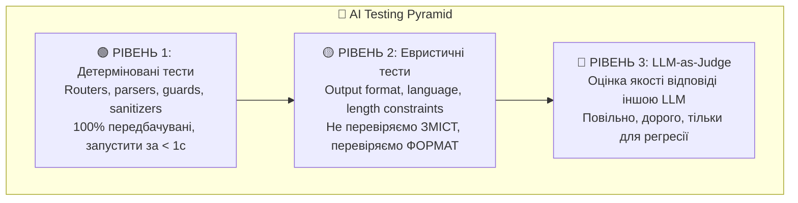

### 6.2 Рівень 1: Детерміновані тести (наш `agent-routing.spec.ts`)

**Що тестуємо:** Все, що **не залежить** від LLM-виходу: router functions, output parsers, content guards.

**Наші тести:**

```typescript
// agent-routing.spec.ts — 12 тестів

// Happy path
it('should route to "search" when plan is "search"');

// Edge case: LLM hallucination protection
it('should fallback to "generator" when plan is "banana"');
it('should fallback to "generator" when plan is a full sentence from LLM');

// Infinite loop protection
it('should force "pass" when retryCount >= MAX_RETRIES (2)');
```

**Чому це критично:** Ці тести ловлять **регресії в бізнес-логіці** без жодного LLM-виклику. Всі 12 тестів проходять за < 0.5 секунди.

### 6.3 Рівень 2: Евристичні тести (наш `agent-evaluation.spec.ts`)

**Що тестуємо:** Парсинг LLM-виходів, content sanitization, format validation.

```typescript
// agent-evaluation.spec.ts — 24 тести

// Planner Output Parsing — 13 тестів
it('should handle LLM with mixed case: "SEARCH"');
it('should extract "search" from verbose LLM output');
it('should fallback to "direct" for non-english output');

// Content Sanitization — 6 тестів
it('should replace undefined with [Tool Execution]');  // LTM crash fix

// Grader Output Parsing — 5 тестів
it('should default to PASS for unrecognizable LLM output');
```

**Принцип:** Ми не перевіряємо **зміст** відповіді LLM — ми перевіряємо, що наш код **коректно обробляє** будь-який вихід LLM, включаючи галюцинації.

### 6.4 Рівень 3: LLM-as-Judge (Template для regression)

**Що це:** Використовуємо **іншу LLM** для оцінки якості відповіді нашого агента.

**Паттерн «Golden Dataset»:**

```typescript
const GOLDEN_DATASET = [
  {
    question: 'Що написано в моїх нотатках про TypeScript?',
    expectedPlan: 'search',
    criteria: {
      language: 'uk',              // Мова відповіді
      mentionsDocuments: true,     // Посилається на джерела
      noHallucination: true,       // Не вигадує факти
    },
  },
  // ...
];

// [LIVE LLM] — запускається вручну, не в CI
it('RAG answer should be in Ukrainian', async () => {
  const response = await agentService.run(dataset[0].question, 'test-user');
  const judge = await evaluatorLlm.invoke([
    new SystemMessage('Is this text written in Ukrainian? Reply "yes" or "no".'),
    new HumanMessage(response.answer),
  ]);
  expect(judge.content).toBe('yes');
}, 30000);
```

**Метрики оцінки RAG (RAGAs framework):**

| Метрика | Що вимірює | Як працює |
|---------|-----------|-----------|
| **Faithfulness** | Чи відповідь базується на документах? | LLM-judge порівнює answer з documents |
| **Relevance** | Чи відповідає на питання? | LLM-judge порівнює answer з question |
| **Groundedness** | Чи кожне твердження має джерело? | Extraction + verification кожного claim |
| **Context Recall** | Чи знайшли правильні документи? | Порівняння retrieved docs з golden docs |

**Наш вбудований грейдер** (`grader.node.ts`) — це по суті Faithfulness + Relevance eval в реальному часі.

> **Правило для інтерв'ю:**  
> _«Ми тестуємо AI-систему на трьох рівнях: детерміновані тести для бізнес-логіки (router, parser) — запускаються в CI за <1с; евристичні — перевіряють обробку будь-якого LLM-виходу; LLM-as-Judge з Golden Dataset — для регресійного тестування якості відповідей. Плюс наш grader — це real-time evaluation в самому графі.»_

---

## Блок 7: Production та AWS Migration Path

> _JD вимагає: «AWS (Bedrock, Lambda, S3, ECS)» та «мікросервісна архітектура».  
> Наш проєкт працює локально — тут ми описуємо стратегію виходу в production._

### 7.1 Local → AWS Service Mapping

| Поточний компонент | Local | AWS Аналог | Міграційна складність |
|---|---|---|---|
| **LLM** | OpenAI API (GPT-4o) | **AWS Bedrock** (Claude, Titan) або залишити OpenAI | 🟡 Medium — зміна LLM provider |
| **Vector DB / Document Search** | OpenSearch (Docker) | **AWS OpenSearch Service** (managed) | 🟢 Low — API ідентичний |
| **Checkpointer** | Redis Stack (Docker) | **AWS ElastiCache for Redis** | 🟡 Medium — потрібен Redis Stack modules |
| **STM Cache** | Redis (Docker) | **AWS ElastiCache** | 🟢 Low — стандартний key-value |
| **Document Storage** | Filesystem / OpenSearch | **AWS S3** + metadata in OpenSearch | 🟡 Medium — абстракція storage |
| **Application** | NestJS (node process) | **AWS ECS Fargate** або **ECS on EC2** | 🟢 Low — Dockerfile → Task Definition |
| **WebSocket** | socket.io (in-process) | **API Gateway WebSocket** або **ALB + ECS** | 🔴 High — sticky sessions needed |
| **CI/CD** | Manual | **AWS CodePipeline** + **ECR** | 🟢 Low — standard pipeline |

### 7.2 Bedrock vs OpenAI: Architectural Decision

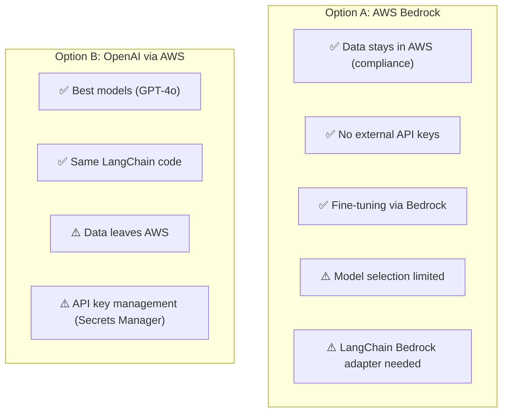

**Рекомендація:** Для eWizard-style pharma/regulated environments — **Bedrock** (data compliance). Зміна в коді мінімальна:

```typescript
// Було:
import { ChatOpenAI } from '@langchain/openai';
const llm = new ChatOpenAI({ model: 'gpt-4o' });

// Стало:
import { ChatBedrock } from '@langchain/aws';
const llm = new ChatBedrock({ model: 'anthropic.claude-3-5-sonnet' });
```

LangChain абстрагує LLM provider — решта графа **не змінюється**.

### 7.3 Microservice Decomposition Strategy

Наш поточний монолін добре структурований для **модульного моноліту** → мікросервіси:

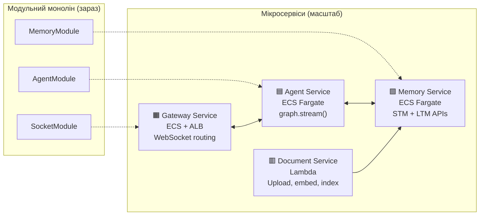

**Принцип декомпозиції:**  
Наші NestJS модулі вже мають чіткі межі (imports/exports). `AgentModule` не знає про `SocketModule` (комунікація через `AgentEventEmitter` — Mediator). Це означає, що розрізати на мікросервіси можна по лінії модулів.

**WebSocket Challenge:**  
WebSocket з'єднання — stateful. При масштабуванні потрібен:
- **Sticky sessions** (ALB) — один клієнт = один інстанс
- Або **Redis Pub/Sub adapter** для socket.io — будь-який інстанс може emit в кімнату

> **Правило для інтерв'ю:**  
> _«Наша архітектура — модульний монолін з чіткими DI-межами. Кожен NestJS Module вже ізольований і спілкується через публічні інтерфейси. Для scaling ми декомпозуємо по лінії модулів: Agent Service (stateless, горизонтально масштабується), Memory Service (state у Redis/OpenSearch), Gateway (WebSocket з Redis pub/sub adapter). LLM provider змінюється однією рядком завдяки LangChain абстракції.»_

---

## Блок 8: Technical Leadership Playbook

> _JD вимагає: «roadmap з абстрактних цілей», «risk identification», «менторство», «онбординг».  
> Цей блок — не про код, а про те, як ти думаєш як лідер._

### 8.1 Від Продуктової Цілі до Technical Roadmap

**Фреймворк «Goal → Spike → Epic → Task»:**

```
Product Goal: "Додати AI-агента, який відповідає на питання по документах"
                            ↓
Technical Spike (1-2 дні):  ← ТИ робиш разом з архітектором
  • POC: LangGraph StateGraph з 3 нодами
  • Оцінка: latency, cost, якість відповідей
  • Результат: ADR (Architecture Decision Record)
                            ↓
Epics (розбиваєш на блоки):
  P0: Базовий RAG (search → generate)    ← 3-5 днів
  P1: Self-correction (grader loop)      ← 2-3 дні
  P2: Tools + HITL                        ← 3-5 днів
  P3: Memory (STM + LTM)                 ← 5-7 днів
  P4: WebSocket streaming                 ← 3-5 днів
                            ↓
Tasks per Epic:
  P2-1: Define graph topology with interruptBefore
  P2-2: Implement tools_caller node
  P2-3: Add ChatGateway WS events
  P2-4: Write agent-routing.spec.ts
  P2-5: Manual QA + regression run
```

**Ключ:** Ти не кажеш PM «це займе 3 місяці». Ти кажеш:
- _«P0 (базовий RAG) готовий за тиждень — це MVP для демо stakeholders»_
- _«P2 (tools + HITL) — це блокер для compliance review, бо без approve люди не будуть довіряти агенту»_
- _«P3 (memory) — найбільший ризик, бо залежить від infra (OpenSearch + Redis Stack)»_

### 8.2 Proactive Risk Matrix

| Ризик | Ймовірність | Вплив | Мітигація | Статус |
|-------|:-:|:-:|-----------|:------:|
| LLM галюцинує факти | Високий | Критичний | Grader + Self-correction loop | ✅ Реалізовано |
| WebSocket disconnect під час HITL | Середній | Високий | Checkpointer зберігає стан → resume після reconnect | ✅ Реалізовано |
| Redis crash → втрата state | Низький | Критичний | Redis persistence (AOF) + named volume | ✅ docker-compose |
| OpenSearch index corruption | Низький | Високий | Index versioning + re-indexing script | ⚠️ TODO |
| LLM provider outage (OpenAI) | Низький | Критичний | Fallback до Bedrock (LangChain абстракція) | ⚠️ Planned |
| Token limit exceeded (context) | Середній | Середній | STM summarisation + maxWindowTokens | ✅ Реалізовано |
| Language drift (мовний дрейф) | Високий | Середній | LANGUAGE_RULE в кожному промпті | ✅ Реалізовано |

**Як це використовувати:**
1. Переглядай Risk Matrix на початку кожного спринту
2. Якщо ймовірність зростає — піднімай пріоритет мітигації
3. Кожен новий Battle Scar → додавай у matrix як «реалізований ризик»

### 8.3 Онбординг нового AI-інженера (Checklist)

**Тиждень 1: Foundations**
- [ ] Прочитати цей `ai-lead-master-guide.md` повністю
- [ ] Запустити проєкт локально (`docker compose up -d` + `npm run start:dev`)
- [ ] Пройти всі тести (`npm run test`) і зрозуміти що вони перевіряють
- [ ] Відправити тестовий запит через WebSocket і простежити flow у логах
- [ ] Зрозуміти граф: намалювати на папері топологію з `agent.graph.ts`

**Тиждень 2: Hands-on**
- [ ] Додати нову ноду в граф (наприклад, `language_detector`)
- [ ] Написати тести для своєї ноди
- [ ] Зробити PR і пройти code review з ментором
- [ ] Розібратися з memory flow: STM → LTM → MemoryOrchestrator

**Тиждень 3: Deep Dive**
- [ ] Зрозуміти HITL flow повністю (від `chat:message` до `agent:interrupt` і `chat:resume`)
- [ ] Попрацювати з Golden Dataset — додати 3 нових test cases
- [ ] Pair programming session з ментором на реальній задачі

### 8.4 Менторство Mid-Level Розробників

**Що делегувати:**
- Нові ноди графа (чисті функції, ізольовані)
- Нові інструменти (tools) — самодостатні, тестуються окремо
- Тести (розширення Golden Dataset)
- Bug fixes з Battle Scars (вже є root cause analysis)

**Що НЕ делегувати (поки):**
- Зміни в топології графа (edges, conditional routing)
- Зміни в State (reducers) — вплив на весь граф
- WebSocket architecture — потребує deep understanding
- Memory orchestration — складна взаємодія 3 систем

**Формат менторства:**
1. **PR Review** — не просто «approve», а залиш пояснення ЧОМУ це рішення правильне
2. **Pair Programming** — 2 рази на тиждень по 1 годині на складних задачах
3. **Architecture Decision Records (ADRs)** — для кожного нетривіального рішення junior/mid пише ADR, ти рев'юїш

> **Правило для інтерв'ю:**  
> _«Я розділяю задачі на "safe to delegate" (нові ноди, tools, тести) та "architect-level" (граф-топологія, state reducers, WS-архітектура). Мідли отримують ізольовані задачі з чіткими контрактами, я займаюся cross-cutting concerns та architectural decisions. Менторство — через PR review з поясненнями "чому" і pair programming.»_

---

## Appendix: Файлова структура

```
src/
├── api/v1/controllers/
│   └── chat.controller.ts          # REST endpoints
├── constants/
│   ├── prompts.ts                  # All LLM prompts + LANGUAGE_RULE
│   └── vector-store.ts             # MEMORY_CONFIG (thresholds, index names)
├── gateways/
│   ├── chat.gateway.ts             # WebSocket Gateway (/chat namespace)
│   └── agent-event.emitter.ts      # Mediator: AgentService → socket.io
├── interfaces/
│   ├── ws/ws-events.interface.ts   # WS event type contracts
│   └── agent/agent.models.ts       # IAgentResponse
├── modules/
│   ├── agent.module.ts
│   ├── agent-event.module.ts       # @Global() AgentEventEmitter
│   ├── checkpointer.module.ts      # RedisSaver factory
│   ├── memory.module.ts            # STM + LTM + TokenCounter
│   └── socket.module.ts            # ChatGateway registration
├── services/
│   ├── agent/
│   │   ├── agent.service.ts        # REST (run/resume/reject) + WS (stream/streamResume)
│   │   ├── agent.graph.ts          # StateGraph topology
│   │   ├── agent.state.ts          # Annotation.Root with reducers
│   │   ├── agent.tools.ts          # Tool registry (summarize, compare, list)
│   │   ├── nodes/                  # planner, search, generator, grader, ...
│   │   ├── router/                 # Conditional edge functions
│   │   ├── tools/                  # Individual tool implementations
│   │   └── utils/message-builder.ts
│   ├── memory/
│   │   ├── memory-orchestrator.service.ts  # Facades STM + LTM
│   │   ├── short-term.memory.ts            # Redis-backed sliding window
│   │   ├── long-term-memory.service.ts     # OpenSearch kNN
│   │   └── token-counter.service.ts
│   └── llm/LlmService.ts          # Tiered LLM (primary + fast)
└── docker-compose.yml              # redis/redis-stack:latest
```

---

> _"The best architecture is the one your team can debug at 3 AM."_  
> — цей проєкт пройшов через 5 таких ночей. Тепер ти знаєш чому.
