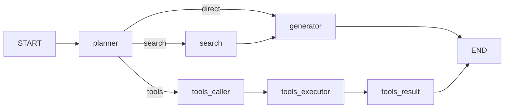
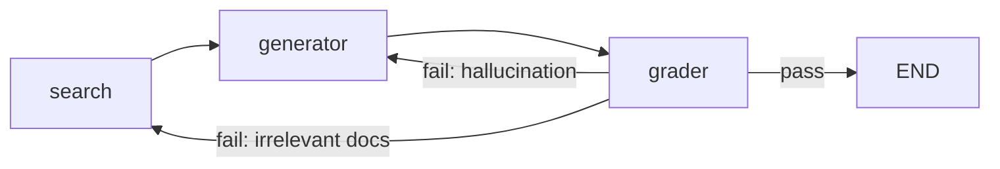
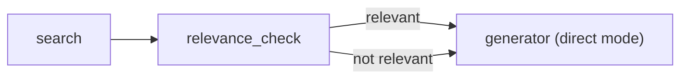

# AI Lead Roadmap — notesQa Production Architecture

> **Автор:** Principal AI Architect
> **Для:** Lead AI Engineer (Ihor K.)
> **Дата:** 2026-03-05
> **Scope:** Архітектурний аудит та технічний roadmap для production-рівня

---

## Резюме поточного стану

Проєкт notesQa побудований на NestJS + LangGraph + OpenSearch. Після рефакторингу кодова база відповідає високим стандартам: DI через інтерфейси, централізована конфігурація, Zod-валідація, Redis-backed STM, OpenSearch kNN LTM.

**Поточна топологія графа:**



**Ключове спостереження:** Граф — **лінійний, без циклів**. Після прийняття рішення планером, агент виконує лише одну гілку і завершується. Це означає: немає самокорекції, немає валідації відповідей, немає можливості "повернутися" і переосмислити plan.

---

## 1. Production-Grade Memory (Checkpointer)

### 1.1 Поточний стан та проблема

Зараз `graph.compile()` викликається **без checkpointer**:

```typescript
// agent.graph.ts — поточний стан
return graph.compile(); // ← без checkpointer
```

Memories управляються **поза графом** — через `MemoryOrchestratorService`, який збирає контекст _до_ запуску графа і зберігає відповідь _після_. Це працює для stateless single-turn flow, але **не підтримує**:

- **Threads** (продовження розмови всередині одного ланцюга виконання)
- **Human-in-the-loop** (зупинка графа і очікування людського input)
- **Time-travel debugging** (перегляд і відкат попередніх станів)
- **Відновлення** після збою (crash recovery)

### 1.2 Стратегія інтеграції Checkpointer

#### Крок 1: Вибір backend

| Backend | Pros | Cons | Рекомендація |
|---------|------|------|-------------|
| `MemorySaver` | Zero setup, dev-only | In-process, втрачається при рестарті | **Dev/Test only** |
| `@langchain/langgraph-checkpoint-redis` | Вже є Redis інфра (STM), швидкий | Може знадобитися Redis Cluster під навантаженням | **Рекомендовано для MVP** |
| `@langchain/langgraph-checkpoint-postgres` | ACID, довговічність, SQL-запити по стану | Додаткова інфраструктура | **Production at scale** |

> **Рекомендація:** Починаємо з Redis (інфраструктура вже є для STM), міграція на Postgres — коли кількість threads перевищить 100K.

#### Крок 2: Інтеграція з NestJS

Ключова зміна — checkpointer має бути **NestJS-провайдером**, а не raw інстансом:

```
CheckpointerModule
├── provides: CHECKPOINTER token (RedisSaver instance)
├── imports: ConfigModule (для redis.url)
└── exports: CHECKPOINTER
```

`AgentModule` імпортує `CheckpointerModule` і передає checkpointer у `buildAgentGraph()`:

```
buildAgentGraph(llm, vectorStore, checkpointer)
  → graph.compile({ checkpointer })
```

#### Крок 3: Thread Management

`AgentService.run()` має приймати `threadId` і передавати його як `configurable`:

```
graph.invoke(initialState, { configurable: { thread_id: threadId } })
```

**Патерн управління сесіями:**

```
ChatController.chat(body)
  → threadId = body.sessionId || uuid()
  → AgentService.run(question, userId, threadId)
    → graph.invoke(state, { configurable: { thread_id: threadId } })
```

> [!IMPORTANT]
> При використанні checkpointer **не потрібно** вручну передавати весь initial state при кожному виклику. Checkpointer автоматично відновлює останній стан для даного `thread_id`. Це означає, що `memoryContext` може бути замінений на native state persistence.

### 1.3 Ризики серіалізації стану

| Поле стану | Тип | Серіалізація | Ризик |
|-----------|-----|-------------|-------|
| `question` | `string` | ✅ Safe | — |
| `plan` | `string` | ✅ Safe | — |
| `documents` | `Document[]` | ⚠️ **Проблема** | `Document` з LangChain містить `metadata: Record<string, any>`. Якщо metadata має non-serializable values (Date objects, functions) — серіалізація зламається |
| `messages` | `BaseMessage[]` | ⚠️ **Проблема** | `BaseMessage` — це клас з методами. Потребує `langgraph` serializers, які вміють десеріалізувати класи правильно |
| `sources` | `Array<{...}>` | ✅ Safe | Plain objects |
| `steps` | `string[]` | ✅ Safe | — |
| `memoryContext` | `Array<{...}>` | ✅ Safe | Plain objects |

**Стратегія мітигації:**

1. **`documents`**: Гарантувати, що `metadata` містить лише примітиви (strings, numbers, booleans). Додати sanitization layer перед записом у стан.
2. **`messages`**: Використовувати `@langchain/langgraph-checkpoint-redis` v1+, який має built-in serializers для LangChain message classes. Не використовувати custom serialization.
3. **Загальне правило:** Не зберігати references на NestJS сервіси, з'єднання з БД, або інші runtime objects у стані графа. Стан має бути **pure data**.

### 1.4 Вплив на існуючу Memory архітектуру

Checkpointer **не замінює** наш MemoryOrchestrator повністю:

| Компонент | Роль після Checkpointer |
|-----------|------------------------|
| **Checkpointer** | Зберігає стан _виконання графа_ (messages, plan, documents) між turns |
| **STM (Redis)** | Залишається для sliding window + summarisation (бізнес-логіка пам'яті) |
| **LTM (OpenSearch)** | Залишається для semantic search по всій історії розмов |
| **MemoryOrchestrator** | Спрощується: не потрібно вручну збирати history, бо checkpointer зберігає messages |

> [!TIP]
> Поступова міграція: спочатку додаємо checkpointer для thread persistence, потім **поступово** переносимо conversation history з `memoryContext` у native `messages` state через `messagesStateReducer`.

---

## 2. Agent Workflow та Механізми самокорекції

### 2.1 Аналіз поточного flow

Поточний граф має **критичний архітектурний gap**: **одноразовість рішення планера**. Після `planner → generator → END` немає можливості:

- Перевірити чи відповідь релевантна питанню
- Виявити галюцинацію
- Визначити чи знайдені документи дійсно відповідають на питання
- Запитати у користувача уточнення

### 2.2 Запропоновані цикли самокорекції

#### Патерн A: Grounded Answer Validator

Додаємо ноду `grader` між `generator` та `END`:



**Нода `grader`** — окремий LLM call з промптом-валідатором:

- **Input:** `{ question, answer, documents }`
- **Output:** `{ verdict: 'pass' | 'fail', reason: string, failType: 'irrelevant_docs' | 'hallucination' | 'incomplete' }`
- **Якщо fail:** повертає граф назад у `search` (з уточненим запитом) або `generator` (з додатковими інструкціями)

> [!WARNING]
> Обов'язково встановлювати **max_retries counter** у стані (наприклад, `retryCount: Annotation<number>`), щоб уникнути нескінченних циклів! Рекомендація: максимум 2 ітерації самокорекції.

#### Патерн B: Document Relevance Gate

Додаємо ноду `relevance_check` між `search` та `generator`:



Ця нода перевіряє score документів і вирішує: чи є сенс будувати RAG-відповідь, чи краще відповісти "документів з такою інформацією не знайдено".

#### Патерн C: Plan Reconsideration

Якщо `search` повернув 0 документів, замість того щоб генерувати порожню відповідь — повернутися до `planner` з feedback:

```
search (0 docs) → planner (retry with feedback) → direct/tools
```

### 2.3 Human-in-the-Loop через Checkpointer

LangGraph підтримує `interrupt_before` / `interrupt_after` — механізм зупинки графа перед виконанням ноди. **Це працює лише з checkpointer.**

**Use case для notesQa:**

1. **Підтвердження tool execution:** Перед виконанням `tools_executor` (delete, bulk operations) — зупинити граф і показати користувачу, який tool буде викликаний з якими параметрами.
2. **Review before send:** Перед `END` — показати draft відповіді з source attribution, дати можливість відхилити або уточнити.

**Технічна реалізація:**

```
graph.compile({
  checkpointer,
  interruptBefore: ['tools_executor'], // зупинка ПЕРЕД нодою
})
```

**Патерн API для Human-in-the-Loop:**

```
POST /chat           → запускає граф, повертає { threadId, status: 'pending_approval', pendingAction: {...} }
POST /chat/approve   → продовжує граф: graph.invoke(null, { configurable: { thread_id } })
POST /chat/reject    → продовжує граф з override: graph.invoke({ plan: 'direct' }, { ... })
```

> [!IMPORTANT]
> Human-in-the-loop вимагає **WebSocket або SSE** для real-time комунікації з фронтендом. REST polling — fallback, але не production-grade UX.

---

## 3. Оцінка та тестування

### 3.1 Проблема тестування non-deterministic систем

Наш агент робить **мінімум 2-3 LLM calls** за запит (planner + generator, або planner + tools_caller + tools_result). Кожен call — non-deterministic. Класичні unit-тести тут не працюють.

### 3.2 Стратегія: Three-Layer Testing

#### Layer 1: Deterministic Unit Tests (Component Level)

| Компонент | Що тестуємо | Як |
|-----------|------------|-----|
| `routeAfterPlan()` | Routing logic | Pure function, mock state |
| `ZodValidationPipe` | Input validation | Невалідні payloads → BadRequestException |
| `formatDocuments()` | Document formatting | Arrays of mock Documents |
| `TokenCounterService` | Token counting | Known strings → expected counts |
| `ShortTermMemoryService` | Window management, summarisation trigger | Mock CacheManager |

#### Layer 2: LLM-as-Judge Evaluation (RAG Quality)

**Інтеграція з LangSmith:**

```
LangSmith Project: "notesqa-eval"
├── Dataset: golden_qa_pairs (question → expected_answer, source_docs)
├── Evaluator: correctness (LLM judges if answer matches expected)
├── Evaluator: faithfulness (answer grounded in retrieved docs?)
├── Evaluator: relevance (retrieved docs relevant to question?)
└── Evaluator: helpfulness (answer actually helps the user?)
```

**Кастомні метрики для нашого pipeline:**

| Метрика | Формула | Ціль |
|---------|---------|------|
| **Planner Accuracy** | correct_plan / total_queries | > 90% |
| **Retrieval Precision@4** | relevant_docs / 4 | > 70% |
| **Answer Faithfulness** | LLM-judge: answer grounded in docs? | > 85% |
| **Tool Selection Accuracy** | correct_tool / total_tool_queries | > 95% |
| **E2E Latency p95** | time from request to response | < 5s |

**Як запускати:**

1. Створити dataset з 50-100 golden pairs (питання + очікувана відповідь + source document)
2. Запускати `langsmith evaluate` після кожного PR що змінює промпти або logic
3. CI/CD gate: faithfulness < 80% → block merge

#### Layer 3: Integration + Load Testing

- **Integration:** Запускати повний flow (REST → Agent → OpenSearch → LLM) на staging з mock LLM (deterministic responses)
- **Load:** k6/Artillery для stress testing OpenSearch kNN під concurrent queries

### 3.3 Observability: LangSmith Tracing

```typescript
// Інтеграція в LlmService constructor:
new ChatOpenAI({
  callbacks: [new LangChainTracer({ projectName: 'notesqa-prod' })],
})
```

Це дає:
- Повний trace кожного LLM call (input/output/latency/tokens)
- Trace всього графа (які ноди виконувались, в якому порядку)
- Cost tracking ($ per query)

---

## 4. Ідентифікація вузьких місць

### 4.1 Bottleneck #1: Послідовний Embedding Pipeline

**Проблема:**

```
AgentService.run()
  → memory.constructFinalPrompt()       // ← embedding call (LTM search)
  → graph.invoke()
    → search node                        // ← embedding call (similarity search)
      → embeddedService.embedQuery()     // ← OpenAI API call, ~200ms
```

Кожен запит робить **мінімум 2 embedding calls** послідовно. Під навантаженням 100 concurrent users → 200 concurrent OpenAI embedding requests → rate limit.

**Рішення:**

1. **Embedding Cache (Redis):** Кешувати `hash(query) → vector`. Якщо той самий запит вже був — не робити API call. TTL 1 година.
2. **Batch Embedding:** Якщо є N запитів в черзі — batch їх в один `embedDocuments()` call замість N окремих `embedQuery()`.
3. **Local Embedding Model:** Для LTM search (менш критичний до якості) — використати локальну модель (ONNX Runtime, `@xenova/transformers`). Latency: ~20ms замість ~200ms.

**Бізнес-імпакт:** Зменшення latency на 30-40% для повторних запитів, зниження OpenAI costs на ~50%.

### 4.2 Bottleneck #2: OpenSearch під навантаженням

**Проблема:**

kNN search з `cosinesimil` + HNSW index — ефективний для <1M vectors. Але:

- **Поточний стан:** Single-node OpenSearch, без реплік для document index, `number_of_replicas: 0` для LTM.
- **Aggregation для `listDocuments`:** `terms` aggregation по `metadata.source.keyword` — сканує весь індекс. При 100K+ документів — повільно.
- **Refresh after bulk index:** `this.refresh()` після кожного `bulkIndex` — блокуюча операція. Під навантаженням з concurrent uploads — кожен upload чекає на refresh всіх попередніх.

**Рішення:**

1. **Read Replicas:** `number_of_replicas: 1` для knowledge-base індексу. Search-запити розподіляються між primary і replica.
2. **Caching aggregation results:** `listDocuments()` result кешувати в Redis на 60 секунд. Invalidate при upload/delete.
3. **Async Refresh:** Замінити `await this.refresh()` на `refresh: 'wait_for'` в bulk request, або використати `refresh_interval: '5s'` на рівні index settings замість manual refresh.
4. **Separate Indices:** Якщо LTM index росте до мільйонів записів — розбити по `userId` (index-per-user або alias routing).

**Бізнес-імпакт:** Готовність до 10x зростання бази документів без деградації latency.

### 4.3 Bottleneck #3: Single LLM Provider Dependency

**Проблема:**

Весь pipeline залежить від одного провайдера (OpenAI). Якщо OpenAI API degrade або rate-limit:

- Planner fails → весь запит fails
- Summarisation fails → STM window grows unbounded
- Generator fails → user отримує 503

**Рішення:**

1. **LLM Router з Fallback:**

```
Primary: gpt-4o-mini (fast, cheap)
Fallback: Claude 3.5 Haiku або Gemini Flash
Strategy: Primary fails 2x → switch to fallback for 5 min
```

2. **Tiered Model Strategy:**

| Операція | Модель | Обґрунтування |
|----------|--------|---------------|
| Planner | gpt-4o-mini | Простий classification, не потребує потужної моделі |
| Generator (RAG) | gpt-4o | Якість критична для UX |
| Summarisation | gpt-4o-mini | Внутрішня операція, якість менш критична |
| Grader (нова нода) | gpt-4o-mini | Classification-like task |

3. **Circuit Breaker Pattern:** Якщо LLM повертає error 3 рази поспіль → graceful degradation (повернути cached response або "Service temporarily unavailable").

**Бізнес-імпакт:** SLA 99.5% → 99.9% availability.

---

## 5. Пріоритизований Roadmap

| Пріоритет | Фіча | Зусилля | Бізнес-вплив | Залежності |
|-----------|-------|---------|-------------|------------|
| **P0** | Checkpointer (Redis) | 2-3 дні | Thread persistence, crash recovery | Redis infra (вже є) |
| **P0** | LangSmith tracing | 1 день | Observability, cost tracking | LangSmith account |
| **P1** | Grounded Answer Validator | 2-3 дні | -30% hallucinations | Checkpointer |
| **P1** | Embedding Cache | 1-2 дні | -40% latency, -50% costs | Redis (вже є) |
| **P1** | Document Relevance Gate | 1 день | Чесніші відповіді при відсутності даних | — |
| **P2** | Human-in-the-loop | 3-5 днів | Контроль над tool execution | Checkpointer, WebSocket |
| **P2** | LLM Fallback Router | 2 дні | 99.9% SLA | Second LLM provider key |
| **P2** | Evaluation Pipeline | 3-5 днів | CI/CD quality gates | LangSmith, golden dataset |
| **P3** | OpenSearch scaling | 2-3 дні | 10x document capacity | Infrastructure |
| **P3** | Local Embedding Model | 2-3 дні | Zero-latency LTM search | ONNX runtime |

---

## 6. Ризики та мітигація

| Ризик | Ймовірність | Вплив | Мітигація |
|-------|------------|-------|-----------|
| OpenAI rate limit під навантаженням | Висока | Критичний | Embedding cache + LLM fallback |
| Нескінченні цикли self-correction | Середня | Критичний | `retryCount` в стані, max 2 ітерації |
| Redis memory overflow (STM + Checkpointer) | Низька | Високий | TTL policies, maxmemory-policy |
| OpenSearch index corruption | Низька | Критичний | Regular snapshots, read replicas |
| State serialization bugs | Середня | Високий | Integration tests, sanitization layer |

---

> **Висновок:** Проєкт має solid foundation після рефакторингу. Наступний крок — P0 items (checkpointer + observability), які розблокують всі подальші фічі. Рекомендую Sprint 1 присвятити саме цим двом задачам — вони дають maximum leverage для всього roadmap.
